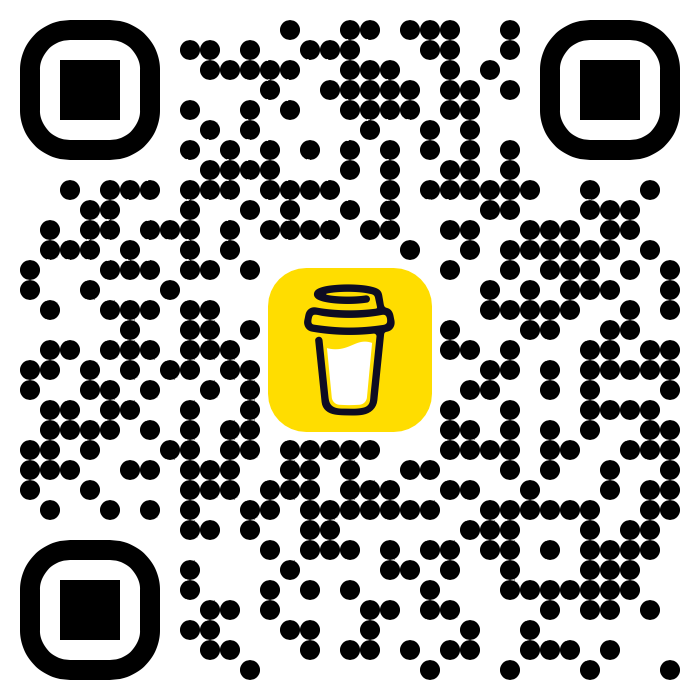

# 🌦️ Nimbus Weather Card

A beautiful, Apple Weather‑inspired custom card for Home Assistant with smooth particle effects, dynamic backgrounds, moon phase support, and local sensor display.


---

## ✨ Features

- **Stunning visuals** – gradient backgrounds, floating particles (rain, snow, fog, clouds, wind, lightning)
- **Dynamic day/night** – automatically switches between sun/moon, starry sky, and colour‑shifting gradients
- **Moon phases** – renders realistic waxing/waning moons with craters — auto‑calculated from date, or from a `moon_entity` sensor
- **Local sensor panel** – display up to 4 local sensors (temperature, humidity, CO₂, etc.) with custom MDI icons, as an alternative to the forecast strip
- **Visual config editor** – configure everything from the HA UI without writing YAML — appears in the Add Card menu
- **Feels‑like temperature** – shows apparent temperature when available from your weather provider
- **Smart units** – automatically converts wind speed (`mph`, `m/s` → `km/h`) and temperature (`°C` / `°F`)
- **Hourly forecast** – shows actual hours (14:00, 15:00…) instead of day names
- **Optimised performance** – debounced updates, icon caching, hardware‑accelerated animations

---

## 📦 Installation

### Via HACS (recommended)

> ⏳ **Pending inclusion in HACS default store.** Until then, add as a custom repository:

1. Open **HACS → Frontend**
2. Click the **3 dots** (top right) → **Custom repositories**
3. Add `https://github.com/maxfok/nimbus-weather-card` with category **Lovelace**
4. Click **Add** → search for **Nimbus Weather Card** → **Download**
5. Refresh your browser cache (`Shift+Reload`)

### Manual

1. Download `nimbus-weather-card.js`
2. Place it in your `config/www/community/nimbus-weather-card/` folder
3. Add to your Lovelace resources:

```yaml
resources:
  - url: /local/community/nimbus-weather-card/nimbus-weather-card.js
    type: module
```

---

## ⚙️ Configuration

### Minimal

```yaml
type: custom:nimbus-weather-card
entity: weather.home
```

### Full options

```yaml
type: custom:nimbus-weather-card
entity: weather.home                      # required
name: "Athens"                            # optional – display name
forecast_type: daily                      # "daily" or "hourly"
max_items: 5                              # number of forecast days/hours (1-7)
show_forecast: true                       # show forecast strip (false = show local sensors)
show_details: true                        # show humidity/wind/pressure
show_feels_like: true                     # show feels‑like temperature
temperature_unit: C                       # "C" or "F"
use_24h: true                             # 24h format for hourly forecast
animation_speed: 1                        # 0 = off, 1 = normal, 2 = fast
sun_entity: sun.sun                       # for precise day/night (optional)
moon_entity: sensor.moon_phase            # for sensor-based moon phases (optional)
local_sensors:                            # shown when show_forecast: false
  - entity: sensor.bedroom_temperature
    icon: mdi:thermometer
    name: Bedroom
  - entity: sensor.living_room_humidity
    icon: mdi:water-percent
    name: Living Room
```

### Options table

| Option | Type | Default | Description |
|---|---|---|---|
| `entity` | string | **required** | Your weather entity ID |
| `name` | string | friendly_name | Custom header text |
| `forecast_type` | string | `daily` | `daily` or `hourly` |
| `max_items` | number | `5` | Max forecast items (1–7) |
| `show_forecast` | boolean | `true` | Show forecast strip |
| `show_details` | boolean | `true` | Show humidity, wind, pressure |
| `show_feels_like` | boolean | `true` | Show "Feels like" temperature |
| `temperature_unit` | string | `C` | `C` or `F` |
| `use_24h` | boolean | `true` | 24h time for hourly forecast |
| `animation_speed` | number | `1` | Speed factor (0 = off) |
| `sun_entity` | string | null | e.g. `sun.sun` |
| `moon_entity` | string | null | e.g. `sensor.moon_phase` |
| `local_sensors` | list | `[]` | Up to 4 local sensors (when forecast off) |

---

## 🌡️ Local Sensors

When `show_forecast: false`, the card shows a local sensor panel instead of the forecast strip. Up to 4 sensors are supported, each with a custom MDI icon and optional label.

```yaml
show_forecast: false
local_sensors:
  - entity: sensor.bedroom_temperature
    icon: mdi:thermometer
    name: Bedroom
  - entity: sensor.co2_level
    icon: mdi:molecule-co2
    name: CO₂
  - entity: sensor.power_consumption
    icon: mdi:lightning-bolt
    name: Power
```

> All icon packs installed via HACS are supported — use any `mdi:` or custom icon.

> The visual config editor lets you add sensors with a **+** button and disable them instantly by turning forecast back on — your sensor settings are preserved.

---

## 🌙 Moon phases

Moon phases are **auto‑calculated from the date** — no sensor required. For higher accuracy, add a moon sensor:

```yaml
moon_entity: moon.moon
```

Install the built-in [Moon Integration](https://www.home-assistant.io/integrations/moon/) and the card will use it automatically.

---

## ☀️ Sun entity

For exact sunrise/sunset timing and elevation‑based colours:

```yaml
sun_entity: sun.sun
```

If omitted, the card falls back to clock‑based day/night detection.

---

## 📱 Examples

### Simple daily forecast

```yaml
type: custom:nimbus-weather-card
entity: weather.openweathermap
max_items: 5
```

### Night‑optimised with moon

```yaml
type: custom:nimbus-weather-card
entity: weather.home
sun_entity: sun.sun
moon_entity: moon.moon
show_details: false
```

### Local sensors instead of forecast

```yaml
type: custom:nimbus-weather-card
entity: weather.home
show_forecast: false
local_sensors:
  - entity: sensor.bedroom_temperature
    icon: mdi:thermometer
    name: Bedroom
  - entity: sensor.living_room_humidity
    icon: mdi:water-percent
    name: Humidity
```

### Fahrenheit

```yaml
type: custom:nimbus-weather-card
entity: weather.weatherkit
temperature_unit: F
```

---

## 🧠 Notes

- The card respects your HA unit system for wind speed — no extra config needed.
- Lightning bolts and screen droplets appear only during rainy/stormy conditions.
- All animations can be disabled with `animation_speed: 0`.
- The card appears in the **Add Card** menu and supports the full visual config editor.

---

## 🐞 Troubleshooting

| Issue | Solution |
|---|---|
| Card not in Add Card menu | Clear browser cache and reload |
| Forecast not updating | Check `forecast_type` matches your weather platform |
| Local sensors not showing | Set `show_forecast: false` |
| Icons not showing | Verify `mdi:` prefix and icon name |
| Particles too heavy | Set `animation_speed: 0` |

---

## 🙏 Credits

Inspired by [Apple Weather](https://apps.apple.com/app/weather/id1069513131) and the amazing Home Assistant community.  
Moon crater SVG originally from [Vecteezy](https://www.vecteezy.com), adapted for dynamic sizing.

---

⭐ If you like this card, consider giving it a star on GitHub!

---

## ☕ Support

[](https://buymeacoffee.com/max_fok)


