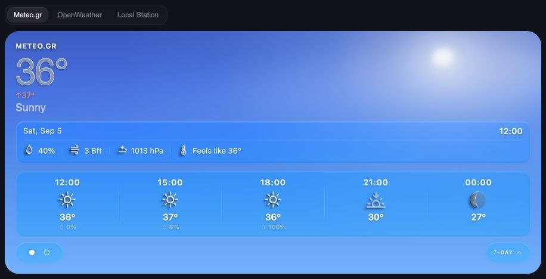
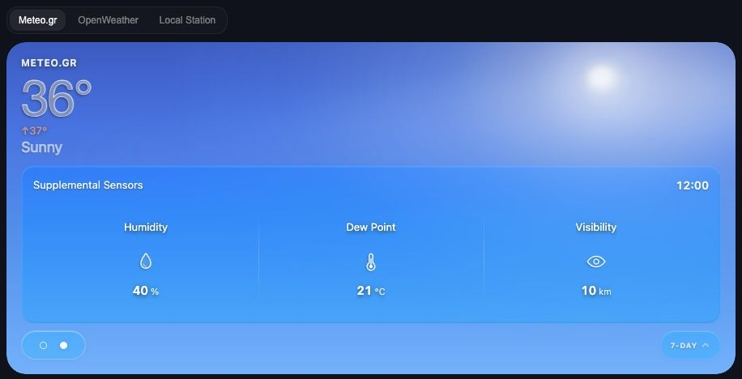

# Nimbus Weather Card

[](https://github.com/maxfok/nimbus-weather-card/releases)
[](https://www.hacs.xyz/)
[](LICENSE)



Nimbus is an atmospheric weather card for Home Assistant. It combines animated day/night skies, hourly or daily forecasts, multiple weather sources, local-station data, and a touch-friendly supplemental-sensor view in one responsive card.

## Quick start

### Install with HACS

1. Open **HACS** from the Home Assistant sidebar.
2. Search for **Nimbus Weather Card**; use the **Dashboard** type filter if needed.
3. Open the repository and select **Download**.
4. Follow any reload prompt from HACS, then refresh the browser or companion app.

Add the card from the dashboard editor, or start with the minimal YAML configuration:

```yaml
type: custom:nimbus-weather-card
entity: weather.home
```

Replace `weather.home` with the entity ID of your weather integration. To use the visual editor, open the target dashboard, select **⋮ → Edit dashboard → Add card**, then search for **Nimbus Weather Card**.

### Manual installation

1. Download `nimbus-weather-card.js` from the latest GitHub release.
2. Copy it to `/config/www/nimbus-weather-card.js`.
3. Add `/local/nimbus-weather-card.js` as a **JavaScript module** under **Settings → Dashboards → ⋮ → Resources**.
4. Refresh the Home Assistant frontend or hard-refresh the client.

If `/config/www` did not already exist, create it and restart Home Assistant once so that `/local/` becomes available. Updating an existing file does not normally require a Home Assistant restart; refresh the frontend instead.

The visual editor covers the common single-source, multi-source, local-station, layout, and extra-sensor settings. YAML remains useful for reusable configurations and advanced options.

## A note on v2.6.0

You asked me for extra sensors. I didn't want to just squeeze them into the card, so I tried to give them a place of their own.

Nimbus 2.6 introduces a dedicated Sensors page alongside the forecast. You can choose which readings belong there, set defaults across your weather sources, or give each source its own selection — without turning the main weather view into a wall of numbers.

That same idea shaped the rest of this release: keep the weather scene intact, make more information available when you want it, and keep it out of the way when you don't.

Thank you to everyone who tested Nimbus, reported the awkward bits, suggested improvements, and helped shape where the card went next.

## What's new in v2.6.0

- Source-aware Forecast/Sensors pages with a fixed outer card and remembered page state per weather source.
- Supplemental-sensor editing, root defaults, and per-source inherit, disable, or replace behaviour.
- Optional precipitation probability below supported forecast-strip items.
- Bidirectional layout support, direction-aware interactions, and larger touch targets.
- Refined Panel Fill behaviour, plus editor compatibility that preserves Local Station configurations built from any supported station metric, even without a temperature sensor.

See [CHANGELOG.md](CHANGELOG.md) for full release details and selected prior release history.

## Core capabilities

- Multiple weather integrations and local weather stations as source tabs.
- Hourly or daily forecast strips, plus an independent expanded forecast dialog for the opposite mode.
- Dynamic sun, moon, clouds, precipitation, fog, snow, lightning, aurora, and night-sky effects.
- Source-local time zones and optional exact coordinates for clocks and sky calculations.
- Supplemental sensor carousel with swipe, keyboard, and pagination controls.
- Optional precipitation probability below forecast items.
- Responsive text presets, Panel Fill mode, explicit corner styles, and reduced-motion support.
- Automatic or explicit left-to-right/right-to-left layout direction.
- Temperature conversion between Celsius and Fahrenheit, plus km/h or Beaufort wind display.
- English, Spanish, German, and Dutch weather-condition and date localization.

## Configuration recipes

### One weather entity

```yaml
type: custom:nimbus-weather-card
entity: weather.home
name: Home
forecast_type: hourly
max_items: 5
show_clock: true
time_zone: Europe/Athens
sun_entity: sun.sun
```

`forecast_type` controls the strip. The button at the bottom-right opens the other forecast mode: a daily strip opens the hourly dialog, while an hourly strip opens the 7-day dialog.

### Multiple weather sources

```yaml
type: custom:nimbus-weather-card
temperature_unit: C
language: en
sources:
  - id: home
    type: weather
    name: Home
    entity: weather.home
    forecast_type: hourly
    max_items: 5
    time_zone: Europe/Athens

  - id: coast
    type: weather
    name: Coast
    entity: weather.coast
    forecast_type: daily
    show_precipitation_probability: true
    time_zone: Europe/Athens
```

Each source can override its forecast type, item count, clock, details, forecast visibility, precipitation probability, time format, time zone, and wind unit. A stable `id` is recommended if you edit or reorder sources because Nimbus uses source identity when restoring the selected tab and carousel page.

### Local Station with reference weather

```yaml
type: custom:nimbus-weather-card
temperature_unit: C
sources:
  - id: forecast
    type: weather
    name: Forecast
    entity: weather.home
    forecast_type: hourly

  - id: garden
    type: local
    name: Garden Station
    reference_entity: weather.home
    temperature: sensor.garden_temperature
    humidity: sensor.garden_humidity
    pressure: sensor.garden_pressure
    wind_speed: sensor.garden_wind_speed
    wind_direction: sensor.garden_wind_direction
    condition: sensor.garden_weather_condition
```

The local entities provide the station readings. `reference_entity` provides forecast data and a weather-condition fallback for visuals when the local station does not provide them. Compact source keys such as `temperature` and their legacy `local_temperature` equivalents are both accepted.

### Supplemental sensors

```yaml
type: custom:nimbus-weather-card
entity: weather.home
local_sensors:
  - entity: sensor.outdoor_dew_point
    name: Dew Point
    icon: mdi:water-thermometer
  - entity: sensor.outdoor_visibility
    name: Visibility
  - entity: sensor.outdoor_air_quality_index
    name: Air Quality
```

With `sources`, the root `local_sensors` list is the default set. Each source has three intentional states:

```yaml
sources:
  # local_sensors omitted: inherit the root defaults
  - id: home
    type: weather
    entity: weather.home

  # explicit empty list: no supplemental page for this source
  - id: coast
    type: weather
    entity: weather.coast
    local_sensors: []

  # non-empty list: use this source-specific set
  - id: station
    type: local
    reference_entity: weather.home
    temperature: sensor.station_temperature
    local_sensors:
      - entity: sensor.station_dew_point
        name: Dew Point
      - entity: sensor.station_uv_index
        name: UV Index
```

When a forecast strip and supplemental sensors are both configured, swipe horizontally across the lower carousel surface outside the sensor row, or tap the pagination pill, to switch between Forecast and Sensors without moving the outer card. Nimbus remembers the selected page separately for each weather source.

The editor supports up to five extra sensors per list. The Sensors page shows three readings at a time; swipe within the sensor row or use the left/right arrow keys while it is focused to move between sensor groups. Unavailable values are skipped. Existing forecast-disabled YAML configurations may keep more than five sensor rows for backward compatibility.



### Precipitation probability

```yaml
type: custom:nimbus-weather-card
entity: weather.home
show_precipitation_probability: true
```

The option defaults to `false`. It can be set at the root or per source:

```yaml
type: custom:nimbus-weather-card
show_precipitation_probability: false
sources:
  - type: weather
    entity: weather.home
    show_precipitation_probability: true
```

Nimbus only renders the row when at least one displayed forecast item contains a valid numeric `precipitation_probability`. A value of `0` is valid. Availability depends on the weather integration and forecast mode.

### Right-to-left layout

```yaml
type: custom:nimbus-weather-card
entity: weather.home
direction: rtl
```

`direction: auto` follows Home Assistant or the surrounding document; `ltr` and `rtl` force a direction. Direction controls layout, gestures, keyboard navigation, and keeps numbers with their units readable. It does not translate interface controls. Nimbus currently offers only the weather-condition and date localization choices listed in the [configuration reference](#configuration-reference).

### Panel Fill

```yaml
type: custom:nimbus-weather-card
entity: weather.home
card_height: fill
text_size: large
corner_style: square
```

`card_height: fill` activates only when Home Assistant places the card in a true Panel view. Nimbus distributes its content through the available height while preserving its normal layout on short landscape panels. Other dashboard layouts fall back to natural card height.

## Interactions and saved state

- **Source tabs:** choose a weather integration or local station. Nimbus restores the active source when possible.
- **Forecast / Sensors pages:** swipe across the lower carousel surface outside the sensor row, or tap the pagination pill, to switch pages. The page is remembered per source and does not reset on normal entity updates.
- **Sensor groups:** when more than three readings are available, swipe within the focused sensor row or use the left/right arrow keys to reveal the next group.
- **Expanded forecast button:** opens the forecast mode opposite the strip and remains independent from the sensor-page control.
- **Forecast sunrise/sunset items:** select the item to reveal the exact event time.
- **Card action:** defaults to More Info for the active source. `tap_action` can instead navigate, open an HTTP(S) URL, or do nothing.
- **Accessibility:** inactive carousel pages are removed from keyboard focus; reduced-motion preferences and larger touch targets are respected.

Saved source and carousel choices use the browser's local storage, so they are local to the client, dashboard path, and source set.

## Configuration reference

### Main options

| Option | Default | Values / purpose |
|---|---:|---|
| `entity` | required without `sources`, except with `local_weather_station: true` | A `weather.*` entity for the legacy single-source configuration. Legacy local-station mode can use its configured sensor entities instead. |
| `sources` | — | List of weather or local-station source objects. When non-empty, source settings drive the card. |
| `active_source` | first / saved source | Optional initial source `id`; a valid source saved on this client takes precedence. |
| `name` | entity name | Single-source display name. |
| `forecast_type` | `daily` | `daily` or `hourly`; controls the strip. |
| `max_items` | `5` | Forecast strip items, clamped to `1`–`7`. |
| `show_forecast` | `true` | Show the forecast strip. |
| `show_precipitation_probability` | `false` | Show precipitation probability below supported forecast items. |
| `show_details` | `true` | Show humidity, wind, pressure, and other available detail values. |
| `show_clock` | `false` | Show the date and time in the details panel. |
| `use_24h` | `true` | Use 24-hour time in forecasts and the clock. |
| `time_zone` | Home Assistant / browser time zone | IANA zone such as `Europe/Athens`; affects display time and sky context. |
| `temperature_unit` | `C` | Output unit: `C` or `F`. Input values use each entity's own unit metadata. |
| `wind_unit` | `kmh` | `kmh` or `beaufort`. |
| `language` | `en` | `en`, `es`, `de`, or `nl`. |
| `direction` | `auto` | `auto`, `ltr`, or `rtl`. This is layout direction, not translation. |
| `text_size` | `standard` | `standard`, `large`, or `extra_large`. |
| `card_height` | `auto` | `auto` or `fill`; fill requires a Home Assistant Panel view. |
| `corner_style` | `auto` | `auto`, `rounded`, or `square`. Auto recognises Fully Kiosk only through its JavaScript interface. |
| `sun_entity` | `sun.sun` | Sun entity used when the active source shares the Home Assistant solar context. |
| `latitude_zone` | `northern_temperate` | Legacy sky fallback: `arctic`, `northern_temperate`, `tropical`, `southern_temperate`, or `antarctic`. |
| `feels_like_entity` | — | Optional apparent-temperature sensor for a single-source card. |
| `local_sensors` | `[]` | Default supplemental sensor objects; each accepts `entity`, optional `name`, and optional `icon`. |
| `animation_speed` | `1` | `1` enables weather motion; `0` keeps a static presentation. |
| `ufo_easter_egg` | `true` | Allow the clear-night UFO easter egg. |
| `tap_action` | More Info | `{action: more-info}`, `navigate`, `url`, or `none`; see the visual editor for fields. |

`moon_entity` is not supported and is intentionally ignored. Nimbus calculates lunar geometry from the render time and active sky context so the hero and forecast moons remain consistent.

`tap_action` supports the following shapes:

```yaml
# Open the active source (default)
tap_action:
  action: more-info

# Navigate inside Home Assistant
tap_action:
  action: navigate
  navigation_path: /lovelace/weather

# Open a safe HTTP(S) URL
tap_action:
  action: url
  url_path: https://example.com/weather

# Disable the whole-card action
tap_action:
  action: none
```

### Source options

| Option | Applies to | Default / purpose |
|---|---|---|
| `id` | both | Optional stable identifier used for saved source and carousel state. |
| `type` | both | `weather` (default) or `local`. |
| `name` | both | Source-tab label. |
| `entity` | weather | Required `weather.*` entity. |
| `reference_entity` | local | Weather entity used for forecast and visual fallback. |
| `temperature`, `humidity`, `wind_speed`, `wind_direction` | both | Source-local sensor entities. |
| `precipitation`, `pressure`, `uv`, `feels_like`, `condition` | both | Additional source-local sensor entities. |
| `forecast_type`, `max_items` | both | Per-source forecast strip overrides. |
| `show_forecast`, `show_precipitation_probability` | both | Per-source forecast visibility overrides. |
| `show_details`, `show_clock`, `use_24h`, `wind_unit` | both | Per-source presentation overrides. |
| `time_zone` | both | Per-source IANA zone; takes precedence over the root `time_zone`. |
| `sky_latitude`, `sky_longitude` | both | Optional exact coordinate pair for source-local solar and lunar context. |
| `local_sensors` | both | Omitted inherits root defaults; `[]` disables; a non-empty list replaces them. |

The compact local keys also accept the legacy `local_` prefix, for example `local_pressure` instead of `pressure`.

### Legacy single-source local station options

Set `local_weather_station: true`, then provide any of these sensor entity IDs:

`local_temperature`, `local_humidity`, `local_wind_speed`, `local_wind_direction`, `local_precipitation`, `local_pressure`, `local_uv`, `local_feels_like`, and `local_condition`.

This mode remains supported for existing YAML. New multi-location setups are usually clearer with a `type: local` item under `sources`.

### Advanced visual compatibility options

| Option | Default | Purpose |
|---|---:|---|
| `aurora_override` | `false` | Force aurora eligibility outside the configured/derived polar latitude zone. |
| `cloud_mode` | `auto` | `auto`, `simple`, or `full`; overrides automatic coarse-pointer cloud rendering. |

## Compatibility and limitations

- Each weather provider decides whether daily forecasts, hourly forecasts, and precipitation probability are available. An unsupported mode can leave the expanded forecast empty.
- Supplemental sensors display an entity's state, unit, and Home Assistant icon; Nimbus does not convert arbitrary supplemental values.
- `direction` provides bidirectional layout support, but it does not add Arabic, Persian, or other translation packs.
- Exact sky coordinates must be supplied as a valid latitude/longitude pair. Otherwise Nimbus falls back to the source time zone, root time zone, or Home Assistant location.
- Panel Fill is intentionally limited to Home Assistant Panel views and falls back safely when the available height is too short.
- Legacy single-source YAML remains supported. The visual editor may normalise known values when it saves the card.

## Troubleshooting

### The card did not change after an update

1. Confirm HACS shows the expected release.
2. Refresh the Home Assistant frontend after updating the resource; a server restart is not normally required.
3. If the old card remains, hard-refresh the browser, clear the companion-app frontend cache, or restart the wall-panel browser.
4. For a manual resource, verify that the registered dashboard resource URL points to `/local/nimbus-weather-card.js`. Add a temporary query to that registered URL, for example `/local/nimbus-weather-card.js?v=2.6.0`, to invalidate an old browser cache.

### Forecast or precipitation values are missing

Check that the selected weather entity supports the configured forecast mode. The precipitation row also requires numeric `precipitation_probability` values in that provider's forecast response. Try the other forecast mode before reporting a card issue.

### The supplemental page is not available

The two-page carousel requires both a visible forecast strip and a non-empty effective `local_sensors` list. With `show_forecast: false`, supplemental sensors use the legacy rows instead. Remember that `local_sensors: []` on a source explicitly disables the inherited root list.

### Panel Fill stays at natural height

Use a dashboard view in **Panel** mode and place Nimbus as the panel card. Fill is not activated in masonry, sections, or grid layouts.

When opening an issue, include your Home Assistant version, Nimbus version, relevant YAML with private data removed, browser/device, weather integration, and screenshots or console errors where possible.

## Contributing and support

- Report bugs or request features in [GitHub Issues](https://github.com/maxfok/nimbus-weather-card/issues).
- Join the [Home Assistant Community discussion](https://community.home-assistant.io/t/nimbus-weather-card/997259).
- Translation contributions should update the condition labels, date locale, editor language list, and related tests together.
- Pull requests should keep backward compatibility, include focused validation, and avoid unrelated formatting changes.

If Nimbus is useful to you, consider starring the repository.

Nimbus Weather Card is available under the [MIT License](LICENSE).
